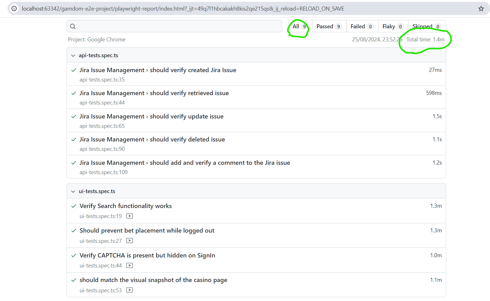

# Gamdom E2E Testing Project (Playwright + TypeScript)


## Overview

This repository contains end-to-end (E2E) tests for the Gamdom platform using Playwright and TypeScript. The tests aim to validate critical functionalities of the web application, ensuring stability and performance. 

## Project Structure
- **`.github`**: Contains GitHub-specific metadata, such as GitHub Actions workflows.
- **`node_modules`**: Contains the project dependencies.
- **`tests/`**: Contains test files that cover various functionalities of the Gamdom platform.
- **`pages/`**: Contains page object models representing different pages of the application.
- **`utils/`**: Includes utility functions and helpers used across the test suite.
- **`playwright.config.ts`**: Configuration file for Playwright.
- **`package.json`**: Contains project dependencies and scripts.

## Prerequisites

Ensure that the following software is installed:

- [Node.js](https://nodejs.org/) (v14.x or higher)
- [npm](https://www.npmjs.com/) or [yarn](https://classic.yarnpkg.com/en/docs/install)

## Project Setup

1. **Clone the Repository**

   ```bash
   git clone https://github.com/JayalakshmiShetty/gamdom.git
2. **Navigate to the project directory**: `cd gamdom`
3. **Install the dependencies**: `npm install`


## Running the Tests

- To run all API tests: `npm run api_tests`
- To run all UI tests on Chrome Browser in headless mode: `npm run ui_tests`
- To run all tests: `npm run all_tests`

 There are various test execution options in the package.json file. Here are some examples:
   * Run UI tests with a user interface: `npm run all_tests_ui`
   * Run UI tests using Chrome: `npm run ui_tests`
   * Run UI tests using Firefox: `npm run ui_firefox`
   * Run UI tests using Firefox in headed mode: `npm run ui_headed_firefox`
   * Run UI tests using Firefox: `npm run ui_chromium`
   * Run UI tests using Firefox in headed mode: `npm run ui_headed_chromium`
   * Run UI tests in debug mode: `npm run test:ui:debug`
   * Generate a test results report: `npm run test:ui:generate-report`

## Reporters
In `playwright.config.ts`, you can specify the type of reporter you want to use for your Playwright tests. You can choose from a variety of built-in reporters or even use a custom reporter. 

***Downloading Artifact Reports From GitHub Actions***

- **Navigate to the GitHub repository**: Open your web browser and go to the GitHub repository.
- **Click on the "Actions" tab**: Find this tab at the top of the repository page.
- **Locate the desired run**: Browse the list of workflow runs to find the one you need, identified by names, statuses, and timestamps.
- **Open the run details**: Click on the specific run to view detailed information.
- **Find the "Artifacts" section**: Scroll down to this section to see the list of artifacts generated during the run.
- **Download the artifact**: Click on the artifact you want to download. It will typically be a `.zip` file.
- **Save and extract**: Save the downloaded file to your local machine, then extract it if needed to view the reports or data.


## GitHub Actions
This project leverages GitHub Actions for continuous integration. The workflow definitions for both API and UI tests are located in the .github/workflows directory, with specific files for each type:
  
   **API tests**: `api-tests.yml`
   
   **UI tests**: `playwright-tests.yml`

Please note that UI tests may currently fail on GitHub Actions due to server location issues affecting website accessibility. Please find the screenshot below.
   

These workflows automate test execution on every push to the repository, providing immediate feedback on test results. This process is crucial for maintaining code quality and identifying issues early.

You can review the outcomes of these workflows in the "Actions" tab of the GitHub repository.


## Successful Tests Screenshot 

Please find successful test videos and AllRuns Screenshot under following directory.
1. **Successful Execution Report**
`
3. **UI Failure Report**

4. **API Failure Report**


## Successful Test Videos  

   **TestCase1: Should match the visual snapshot of the casino-page**

 
  **TestCase2:Should prevent bet placement while logged-out**


  **TestCase3:Verify CAPTCHA is present but hidden on SignIn**


  **TestCase4:Verify Game Search functionality works**


## Exploratory testing Key Areas
1. **Bet Placement and Wagering Functionality**
Ensure users can place bets on both sports and casino games without issues.

      * Sports Page:
  
         - Place a bet on various sports events.
  
         - Verify the odds are correctly updated and reflect the user's selection.
  
         - Check the bet slip functionality to ensure users can view, modify, and confirm their bets.
  
      * Casino Page:
        
         - Place wagers on different casino games (e.g., slots, table games).
        
         - Verify that game results and payouts are calculated correctly.
        
         - Ensure users can see their bet history and transaction records.

3. **User Account and Authentication**
Validate that users can securely log in, register, and manage their accounts.
      
      * Login and Registration:

          - Test login with valid and invalid credentials.
   
          - Check the registration process for new users, including email verification and password strength requirements.
   
      * Account Management:
   
          - Verify users can update their profile information, such as email and password.
   
          - Test account recovery options (e.g., password reset).

4. **Payment and Withdrawal Processing**
Ensure users can deposit funds, withdraw money, and view transaction history.
      
      * Deposits:
   
          - Test various payment methods (credit/debit cards, e-wallets, etc.) to ensure deposits are processed correctly.
      
      * Withdrawals:
         
          - Verify that withdrawal requests are handled promptly and accurately.
          
          - Check that withdrawal methods are functioning and that users receive their funds within the promised timeframe.

5. **Game Functionality and User Experience**
Verify that all casino games and sports betting features are functioning correctly and provide a good user experience.

      * Casino Games:
   
          - Test various games for functionality, including slots, table games, and live dealer options.
   
          - Ensure that games load correctly, respond to user inputs, and provide accurate results.
   
      * Sports Betting:
   
          - Check the display and updating of sports events, odds, and betting options.
   
          - Verify that bet placements and odds calculations are accurate.

6. **Customer Support Integration**
Ensure that customer support is accessible and functional.

      * Live Chat:
   
          - Test the live chat feature for responsiveness and effectiveness in resolving user queries.
   
      * Contact Forms:
   
          - Verify that contact forms are working and submissions are received by the support team.
   
      * Help Resources:
   
          - Check the availability and accuracy of help resources, such as FAQs and user guides.
       
            
## Bug found while testing
1. **Casino sharebet link is opned instead of Sports share bet link on sharing sports sharebet link**
   Steps to Reproduce:
      1. Navigate to "https://gamdom.com/sports" Sports page
      2. Click on any odds on sports page to have selection in betslip.
      3. Copy betting code
      4. Paste and open the copied bet code in a new incognito window.

**Actual Result**:
The link opens the casino page with a share bet code, such as: https://gamdom.com/casino?shareBet=wuoII1E0. Instead of displaying the Sports bet coupon page, the Casino Sports page is shown.
   
**Expected Result**:
The Sports bet coupon page should be displayed when opening the sports bet code link in incognito mode.


**Bug Video:**


